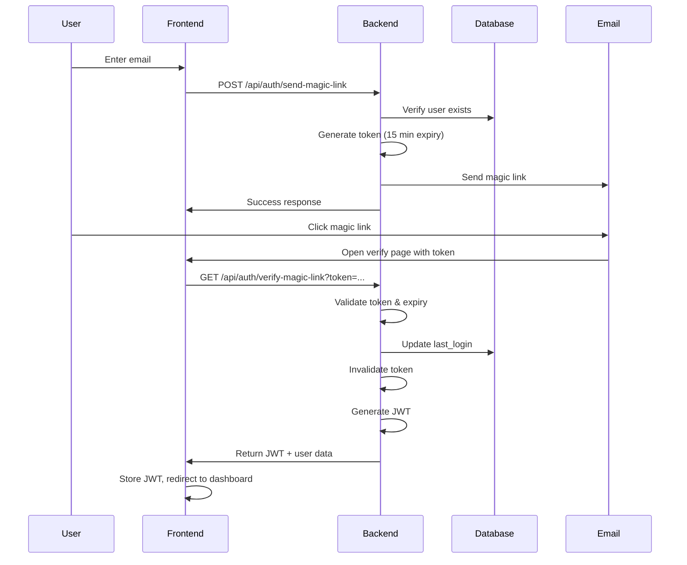

# Design Document: Enhanced Authentication, Admin Dashboard, and Anonymous Bidding

## Overview

This design document describes three major enhancements to the Teacher Marketplace platform:

1. **Email-Only Authentication with Magic Links**: Enables passwordless authentication for @lincoln.edu.gh users through time-limited, one-time use magic links sent via email.

2. **Admin Dashboard & Management**: Provides comprehensive administrative controls including user management, listing moderation, activity logging, and system configuration.

3. **Anonymous Bidding System**: Allows users to place anonymous bids on marketplace listings while maintaining privacy from other bidders, with sellers retaining full visibility.

These features are already implemented in TypeScript using Node.js/Express backend and React frontend, with PostgreSQL as the database.

## Architecture

### System Components

```
┌─────────────────────────────────────────────────────────────┐
│                        Frontend (React)                      │
│  ┌──────────────┐  ┌──────────────┐  ┌──────────────┐      │
│  │ Magic Link   │  │    Admin     │  │   Bidding    │      │
│  │   Pages      │  │  Dashboard   │  │    Panel     │      │
│  └──────────────┘  └──────────────┘  └──────────────┘      │
└─────────────────────────────────────────────────────────────┘
                            │
                            ▼
┌─────────────────────────────────────────────────────────────┐
│                   Backend API (Express)                      │
│  ┌──────────────┐  ┌──────────────┐  ┌──────────────┐      │
│  │ Auth Routes  │  │ Admin Routes │  │ Bidding      │      │
│  │              │  │              │  │ Routes       │      │
│  └──────────────┘  └──────────────┘  └──────────────┘      │
│         │                 │                  │              │
│         ▼                 ▼                  ▼              │
│  ┌──────────────┐  ┌──────────────┐  ┌──────────────┐      │
│  │ Auth Service │  │ Admin Service│  │ Bidding      │      │
│  │              │  │              │  │ Service      │      │
│  └──────────────┘  └──────────────┘  └──────────────┘      │
└─────────────────────────────────────────────────────────────┘
                            │
                            ▼
┌─────────────────────────────────────────────────────────────┐
│                   PostgreSQL Database                        │
│  ┌──────────────┐  ┌──────────────┐  ┌──────────────┐      │
│  │    users     │  │ admin_       │  │    bids      │      │
│  │              │  │ activity_log │  │              │      │
│  └──────────────┘  └──────────────┘  └──────────────┘      │
│  ┌──────────────┐  ┌──────────────┐                        │
│  │  listings    │  │   system_    │                        │
│  │              │  │   settings   │                        │
│  └──────────────┘  └──────────────┘                        │
└─────────────────────────────────────────────────────────────┘
```

### Authentication Flow



### Bidding Privacy Model

The bidding system implements a context-aware privacy model:

- **Bidder's View**: Can always see their own identity and bid details
- **Seller's View**: Can see all bidder identities (anonymous or not) for their listings
- **Other Users' View**: See anonymous bids as "Anonymous Bidder" with no contact information
- **API Layer**: Filters bidder information based on the requesting user's relationship to the listing

## Components and Interfaces

### 1. Magic Link Authentication

#### Backend Service Interface

```typescript
interface MagicLinkService {
  // Generate and send magic link
  sendMagicLink(email: string): Promise<{ success: boolean; magicLink?: string }>;
  
  // Verify magic link token
  verifyMagicLink(token: string): Promise<{ token: string; user: User }>;
}
```

#### API Endpoints

**POST /api/auth/send-magic-link**
- Request: `{ email: string }`
- Response: `{ message: string, magicLink?: string }`
- Validates @lincoln.edu.gh domain
- Generates cryptographically secure token
- Sets 15-minute expiration
- Sends email with magic link

**GET /api/auth/verify-magic-link**
- Query: `token=<string>`
- Response: `{ token: string, user: User }`
- Validates token exists and not expired
- Authenticates user and creates session
- Invalidates token after use
- Returns JWT for subsequent requests

#### Token Storage

Magic link tokens are stored in-memory (Map) with structure:
```typescript
{
  token: string,
  email: string,
  expiresAt: number  // Unix timestamp
}
```

In production, this should use Redis for distributed systems.

### 2. Admin Dashboard

#### Backend Service Interface

```typescript
interface AdminService {
  // Dashboard statistics
  getDashboardStats(): Promise<AdminStats>;
  
  // User management
  getAllUsers(page: number, limit: number): Promise<PaginatedUsers>;
  updateUserRole(adminId: string, userId: string, role: 'teacher' | 'admin'): Promise<void>;
  suspendUser(adminId: string, userId: string, reason: string, durationDays: number): Promise<void>;
  
  // Listing management
  getAllListings(filters: ListingFilters): Promise<PaginatedListings>;
  deleteListing(adminId: string, listingId: string, reason: string): Promise<void>;
  
  // Activity logging
  getActivityLog(page: number, limit: number): Promise<PaginatedActivityLog>;
  logActivity(adminId: string, action: string, targetType: string, targetId?: string, details?: any, ipAddress?: string): Promise<void>;
  
  // System settings
  getSystemSettings(): Promise<Record<string, any>>;
  updateSystemSetting(adminId: string, key: string, value: any): Promise<void>;
}
```

#### API Endpoints

**GET /api/admin/dashboard**
- Requires: Admin authentication
- Response: `AdminStats` with counts and recent activity

**GET /api/admin/users**
- Requires: Admin authentication
- Query: `page`, `limit`
- Response: Paginated user list with listing/transaction counts

**PUT /api/admin/users/:id/role**
- Requires: Admin authentication
- Request: `{ role: 'teacher' | 'admin' }`
- Logs action to activity log

**POST /api/admin/users/:id/suspend**
- Requires: Admin authentication
- Request: `{ reason: string, durationDays: number }`
- Creates suspension record, logs action

**GET /api/admin/listings**
- Requires: Admin authentication
- Query: `status`, `category`, `flagged`, `page`, `limit`
- Response: Paginated listing list with bid/flag counts

**DELETE /api/admin/listings/:id**
- Requires: Admin authentication
- Request: `{ reason: string }`
- Soft deletes listing, logs action

**GET /api/admin/activity-log**
- Requires: Admin authentication
- Query: `page`, `limit`
- Response: Paginated activity log with admin details

**GET /api/admin/settings**
- Requires: Admin authentication
- Response: All system settings as key-value pairs

**PUT /api/admin/settings/:key**
- Requires: Admin authentication
- Request: `{ value: any }`
- Updates setting, logs action

#### Middleware

```typescript
const requireAdmin = (req, res, next) => {
  if (req.user.role !== 'admin') {
    return res.status(403).json({ error: 'Admin access required' });
  }
  next();
};
```

### 3. Anonymous Bidding System

#### Backend Service Interface

```typescript
interface BiddingService {
  // Place a bid
  placeBid(listingId: string, bidderId: string, amount: number, isAnonymous: boolean, message?: string): Promise<Bid>;
  
  // Get bids for a listing (with privacy filtering)
  getListingBids(listingId: string, requesterId: string): Promise<BidWithDetails[]>;
  
  // Get user's own bids
  getUserBids(userId: string): Promise<BidWithDetails[]>;
  
  // Bid management
  acceptBid(bidId: string, sellerId: string): Promise<void>;
  rejectBid(bidId: string, sellerId: string): Promise<void>;
  withdrawBid(bidId: string, bidderId: string): Promise<void>;
}
```

#### API Endpoints

**POST /api/bids**
- Requires: Authentication
- Request: `{ listingId: string, amount: number, isAnonymous: boolean, message?: string }`
- Validates: listing exists, bidding enabled, not own listing, meets minimum/increment
- Creates bid, notifies seller

**GET /api/bids/listings/:id**
- Requires: Authentication
- Response: Bids with privacy filtering based on requester
- Sellers see all details, others see anonymized data

**GET /api/bids/my-bids**
- Requires: Authentication
- Response: All bids placed by authenticated user

**POST /api/bids/:id/accept**
- Requires: Authentication (seller only)
- Marks bid as accepted, rejects other bids, updates listing status

**POST /api/bids/:id/reject**
- Requires: Authentication (seller only)
- Marks bid as rejected, notifies bidder

**DELETE /api/bids/:id**
- Requires: Authentication (bidder only)
- Withdraws active bid

#### Privacy Filtering Logic

```typescript
// In getListingBids
const isSeller = listing.seller_id === requesterId;

SELECT 
  b.id,
  b.amount,
  b.status,
  CASE 
    WHEN b.is_anonymous AND NOT isSeller THEN NULL 
    ELSE b.bidder_id 
  END as bidder_id,
  CASE 
    WHEN b.is_anonymous AND NOT isSeller THEN 'Anonymous Bidder' 
    ELSE u.name 
  END as bidder_name,
  CASE 
    WHEN b.is_anonymous AND NOT isSeller THEN NULL 
    ELSE u.email 
  END as bidder_email
FROM bids b
LEFT JOIN users u ON b.bidder_id = u.id
WHERE b.listing_id = $1
```

## Data Models

### Database Schema Updates

#### Users Table Modifications
```sql
ALTER TABLE users ALTER COLUMN password_hash DROP NOT NULL;
ALTER TABLE users ADD COLUMN auth_method VARCHAR(20) DEFAULT 'password' 
  CHECK (auth_method IN ('password', 'email_only'));
ALTER TABLE users ADD COLUMN last_login TIMESTAMP;
```

#### Bids Table
```sql
CREATE TABLE bids (
  id UUID PRIMARY KEY DEFAULT uuid_generate_v4(),
  listing_id UUID NOT NULL REFERENCES listings(id) ON DELETE CASCADE,
  bidder_id UUID NOT NULL REFERENCES users(id),
  amount DECIMAL(10, 2) NOT NULL CHECK (amount > 0),
  is_anonymous BOOLEAN DEFAULT FALSE,
  status VARCHAR(20) NOT NULL DEFAULT 'active' 
    CHECK (status IN ('active', 'accepted', 'rejected', 'withdrawn')),
  message TEXT CHECK (message IS NULL OR LENGTH(message) <= 500),
  created_at TIMESTAMP DEFAULT CURRENT_TIMESTAMP,
  updated_at TIMESTAMP DEFAULT CURRENT_TIMESTAMP
);
```

#### Admin Activity Log Table
```sql
CREATE TABLE admin_activity_log (
  id UUID PRIMARY KEY DEFAULT uuid_generate_v4(),
  admin_id UUID NOT NULL REFERENCES users(id),
  action VARCHAR(100) NOT NULL,
  target_type VARCHAR(50) NOT NULL,
  target_id UUID,
  details JSONB,
  ip_address VARCHAR(45),
  created_at TIMESTAMP DEFAULT CURRENT_TIMESTAMP
);
```

#### System Settings Table
```sql
CREATE TABLE system_settings (
  key VARCHAR(100) PRIMARY KEY,
  value JSONB NOT NULL,
  description TEXT,
  updated_by UUID REFERENCES users(id),
  updated_at TIMESTAMP DEFAULT CURRENT_TIMESTAMP
);
```

#### Listings Table Modifications
```sql
ALTER TABLE listings ADD COLUMN bidding_enabled BOOLEAN DEFAULT FALSE;
ALTER TABLE listings ADD COLUMN minimum_bid DECIMAL(10, 2);
ALTER TABLE listings ADD COLUMN bid_increment DECIMAL(10, 2) DEFAULT 1.00;
ALTER TABLE listings ADD COLUMN highest_bid_id UUID REFERENCES bids(id);
```

### TypeScript Interfaces

```typescript
interface User {
  id: string;
  email: string;
  name: string;
  schoolAffiliation: string;
  role: 'teacher' | 'admin';
  authMethod: 'password' | 'email_only';
  lastLogin?: Date;
  emailVerified: boolean;
  createdAt: Date;
}

interface Bid {
  id: string;
  listingId: string;
  bidderId: string;
  amount: number;
  isAnonymous: boolean;
  status: 'active' | 'accepted' | 'rejected' | 'withdrawn';
  message?: string;
  createdAt: Date;
  updatedAt: Date;
}

interface BidWithDetails extends Bid {
  bidderName: string;
  bidderEmail?: string;  // Only visible to seller
}

interface AdminActivityLog {
  id: string;
  adminId: string;
  action: string;
  targetType: string;
  targetId?: string;
  details?: any;
  ipAddress?: string;
  createdAt: Date;
}

interface AdminStats {
  totalUsers: number;
  totalListings: number;
  activeListings: number;
  totalTransactions: number;
  totalBids: number;
  flaggedListings: number;
  recentActivity: any[];
}
```

## Correctness Properties

A property is a characteristic or behavior that should hold true across all valid executions of a system—essentially, a formal statement about what the system should do. Properties serve as the bridge between human-readable specifications and machine-verifiable correctness guarantees.

### Magic Link Authentication Properties

**Property 1: Email domain validation**
*For any* email address, the system should accept magic link requests if and only if the email ends with @lincoln.edu.gh
**Validates: Requirements 1.1, 1.6**

**Property 2: Magic link expiration time**
*For any* generated magic link, the expiration time should be exactly 15 minutes (900 seconds) from the creation timestamp
**Validates: Requirements 1.2**

**Property 3: Valid magic link authentication**
*For any* magic link with a valid token and timestamp within 15 minutes of creation, verification should succeed and return a valid JWT token
**Validates: Requirements 1.3**

**Property 4: One-time use enforcement**
*For any* magic link, after successful verification, a second verification attempt with the same token should fail
**Validates: Requirements 1.4**

**Property 5: Expired magic link rejection**
*For any* magic link with a timestamp older than 15 minutes, verification should fail with an expiration error
**Validates: Requirements 1.5**

**Property 6: Token storage security**
*For any* magic link token stored in the system, the stored value should be different from the original token (hashed)
**Validates: Requirements 2.2**

**Property 7: Failed authentication logging**
*For any* failed magic link authentication attempt, an activity log entry should be created with timestamp and IP address
**Validates: Requirements 2.4**

**Property 8: Rate limiting**
*For any* email address, after N magic link requests within a time window, subsequent requests should be rejected until the window expires
**Validates: Requirements 2.5**

### Admin Dashboard Properties

**Property 9: User count accuracy**
*For any* database state, the dashboard user count should equal the number of rows in the users table
**Validates: Requirements 3.1**

**Property 10: Active listing count accuracy**
*For any* database state, the dashboard active listing count should equal the number of listings with status='active'
**Validates: Requirements 3.2**

**Property 11: Transaction count accuracy**
*For any* database state, the dashboard transaction count should equal the number of rows in the transactions table
**Validates: Requirements 3.3**

**Property 12: Bid count accuracy**
*For any* database state, the dashboard bid count should equal the number of rows in the bids table
**Validates: Requirements 3.4**

**Property 13: Flagged content count accuracy**
*For any* database state, the dashboard flagged count should equal the number of flags with status='pending'
**Validates: Requirements 3.5**

**Property 14: User list completeness**
*For any* database state, the admin user list should contain all users with their email, role, and account status
**Validates: Requirements 4.1**

**Property 15: Role update persistence and logging**
*For any* user and valid role ('teacher' or 'admin'), after an admin updates the role, the user's role in the database should match the new role and an activity log entry should exist
**Validates: Requirements 4.2**

**Property 16: Suspension enforcement**
*For any* suspended user, login attempts should fail with a suspension error message
**Validates: Requirements 4.3, 4.4**

**Property 17: User details display**
*For any* user, the admin panel should display their authentication method and last login timestamp
**Validates: Requirements 4.5**

**Property 18: Self-suspension prevention**
*For any* admin user, attempting to suspend their own account should fail with an error
**Validates: Requirements 4.6**

**Property 19: Listing list completeness**
*For any* database state, the admin listing list should contain all listings with title, seller, status, and creation date
**Validates: Requirements 5.1**

**Property 20: Listing deletion and logging**
*For any* listing, after an admin deletes it, the listing status should be 'deleted' and an activity log entry should exist with the deletion reason
**Validates: Requirements 5.2**

**Property 21: Flagged content filtering**
*For any* database state, the flagged content view should contain only listings that have pending flags
**Validates: Requirements 5.3**

**Property 22: Deletion notification**
*For any* listing deleted by an admin, a notification should be created for the seller
**Validates: Requirements 5.4**

**Property 23: Listing filtering**
*For any* filter criteria (status, seller, date range), the returned listings should match all specified criteria
**Validates: Requirements 5.5**

**Property 24: Activity logging completeness**
*For any* admin action, an activity log entry should be created with action type, timestamp, and administrator ID
**Validates: Requirements 6.1**

**Property 25: IP address logging**
*For any* activity log entry, the IP address field should contain the IP address from which the action was performed
**Validates: Requirements 6.2**

**Property 26: Activity log ordering**
*For any* activity log query, results should be sorted by created_at in descending order (newest first)
**Validates: Requirements 6.3**

**Property 27: Activity log filtering**
*For any* filter criteria (action type, administrator, date range), the returned log entries should match all specified criteria
**Validates: Requirements 6.4**

**Property 28: Activity log immutability**
*For any* activity log entry, attempts to modify or delete it should fail
**Validates: Requirements 6.5**

**Property 29: System settings display**
*For any* system setting key, the admin panel should display its current value
**Validates: Requirements 7.1, 7.3**

**Property 30: Email domain validation and persistence**
*For any* email domain string, the system should accept it if it's a valid domain format, and after saving, the stored value should match the input
**Validates: Requirements 7.2**

**Property 31: Bidding settings validation**
*For any* minimum bid or bid increment value, the system should accept it if and only if it's a positive number
**Validates: Requirements 7.4**

**Property 32: Settings change logging**
*For any* system setting modification, an activity log entry should be created
**Validates: Requirements 7.5**

**Property 33: Settings immediate application**
*For any* system setting change, operations performed immediately after the change should use the new value
**Validates: Requirements 7.6**

### Anonymous Bidding Properties

**Property 34: Bid creation**
*For any* valid bid (listing exists, bidding enabled, not own listing, meets minimum/increment), the bid should be created with the correct amount and bidder ID
**Validates: Requirements 8.1**

**Property 35: Anonymous flag persistence**
*For any* bid created with isAnonymous=true, the is_anonymous field in the database should be true
**Validates: Requirements 8.2**

**Property 36: Minimum bid validation**
*For any* bid with amount less than the listing's minimum bid, the bid should be rejected with an error
**Validates: Requirements 8.3**

**Property 37: Bid increment validation**
*For any* listing with existing bids, a new bid should be rejected if it doesn't exceed the highest bid by at least the bid increment
**Validates: Requirements 8.4**

**Property 38: Self-bidding prevention**
*For any* user and listing where the user is the seller, bid attempts should be rejected with an error
**Validates: Requirements 8.5**

**Property 39: Bid notification**
*For any* successfully placed bid, a notification should be created for the seller
**Validates: Requirements 8.6**

**Property 40: Anonymous bid privacy for non-sellers**
*For any* anonymous bid and non-seller requester, the bid data should show "Anonymous Bidder" as the name and null for bidder_id and email
**Validates: Requirements 9.1**

**Property 41: Seller visibility of all bidders**
*For any* bid on a listing and the seller of that listing, the bid data should include the actual bidder ID, name, and email regardless of anonymity
**Validates: Requirements 9.2**

**Property 42: Bidder self-visibility**
*For any* bid and the bidder who created it, the bid data should include their actual identity regardless of anonymity setting
**Validates: Requirements 9.3**

**Property 43: Email privacy enforcement**
*For any* bid query by a non-seller, the response should not include bidder email addresses
**Validates: Requirements 9.4**

**Property 44: Bidding toggle persistence**
*For any* listing, after setting bidding_enabled to true or false, the stored value should match the input
**Validates: Requirements 10.1**

**Property 45: Minimum bid requirement**
*For any* listing, attempting to enable bidding without specifying a minimum bid should fail with a validation error
**Validates: Requirements 10.2**

**Property 46: Bid increment requirement**
*For any* listing, attempting to enable bidding without specifying a bid increment should fail with a validation error
**Validates: Requirements 10.3**

**Property 47: Disabled bidding enforcement**
*For any* listing with bidding_enabled=false, bid attempts should be rejected with an error
**Validates: Requirements 10.4**

**Property 48: Existing bids preservation**
*For any* listing with existing bids, changing bidding settings should not modify or delete those bids
**Validates: Requirements 10.5**

**Property 49: Positive bidding values validation**
*For any* minimum bid or bid increment value, the system should reject zero or negative values
**Validates: Requirements 10.6**

**Property 50: Bid acceptance state change**
*For any* bid, after a seller accepts it, the bid status should be 'accepted' and the listing status should be 'sold'
**Validates: Requirements 11.1**

**Property 51: Bid rejection and notification**
*For any* bid, after a seller rejects it, the bid status should be 'rejected' and a notification should be created for the bidder
**Validates: Requirements 11.2**

**Property 52: Bid withdrawal**
*For any* active bid, after the bidder withdraws it, the bid status should be 'withdrawn'
**Validates: Requirements 11.3**

**Property 53: Cascade rejection on acceptance**
*For any* listing with multiple active bids, after accepting one bid, all other active bids should have status 'rejected'
**Validates: Requirements 11.4**

**Property 54: Bid sorting by amount**
*For any* listing, the bids should be returned sorted by amount in descending order (highest first)
**Validates: Requirements 11.5**

**Property 55: Accepted bid withdrawal prevention**
*For any* bid with status 'accepted', withdrawal attempts should fail with an error
**Validates: Requirements 11.6**

**Property 56: Minimum acceptable bid calculation**
*For any* listing, the minimum acceptable bid should be the maximum of (minimum_bid, highest_bid + bid_increment)
**Validates: Requirements 12.1**

**Property 57: User bid history filtering**
*For any* user, their bid history should contain only bids where bidder_id equals their user ID
**Validates: Requirements 12.4**

**Property 58: Bid response completeness**
*For any* bid query response, each bid should include status, amount, timestamp, and appropriately filtered bidder information
**Validates: Requirements 12.5**

**Property 59: Duplicate bid prevention**
*For any* user and listing, attempting to place two bids with identical amounts should result in the second attempt being rejected
**Validates: Requirements 12.6**

## Error Handling

### Magic Link Authentication Errors

- **Invalid Email Domain**: Return 400 with message "Only @lincoln.edu.gh email addresses are allowed"
- **User Not Found**: Return 404 with message "User not found. Please register first."
- **Invalid Token**: Return 400 with message "Invalid or expired magic link"
- **Expired Token**: Return 400 with message "Magic link has expired"
- **Rate Limit Exceeded**: Return 429 with message "Too many requests. Please try again later."

### Admin Dashboard Errors

- **Unauthorized Access**: Return 403 with message "Admin access required"
- **Invalid Role**: Return 400 with message "Invalid role"
- **Self-Suspension**: Return 400 with message "Cannot suspend your own account"
- **Missing Required Fields**: Return 400 with descriptive message about missing field

### Bidding System Errors

- **Listing Not Found**: Return 404 with message "Listing not found"
- **Bidding Disabled**: Return 400 with message "Bidding is not enabled for this listing"
- **Self-Bidding**: Return 400 with message "You cannot bid on your own listing"
- **Below Minimum**: Return 400 with message "Bid must be at least {minimum}"
- **Insufficient Increment**: Return 400 with message "Bid must be at least {required_amount}"
- **Unauthorized Bid Action**: Return 403 with message "Only the seller can accept/reject bids"
- **Invalid Bid Withdrawal**: Return 400 with message "Can only withdraw active bids"

All errors are logged with appropriate context for debugging and security monitoring.

## Testing Strategy

### Dual Testing Approach

This feature requires both unit testing and property-based testing for comprehensive coverage:

- **Unit Tests**: Verify specific examples, edge cases, and error conditions
- **Property Tests**: Verify universal properties across all inputs through randomization

Both approaches are complementary and necessary. Unit tests catch concrete bugs in specific scenarios, while property tests verify general correctness across a wide range of inputs.

### Property-Based Testing Configuration

**Library**: Use `fast-check` for TypeScript/JavaScript property-based testing

**Configuration**:
- Minimum 100 iterations per property test (due to randomization)
- Each property test must reference its design document property
- Tag format: `// Feature: enhanced-authentication-admin-bidding, Property {number}: {property_text}`

**Example Property Test Structure**:
```typescript
import fc from 'fast-check';

// Feature: enhanced-authentication-admin-bidding, Property 1: Email domain validation
test('accepts only @lincoln.edu.gh emails for magic links', () => {
  fc.assert(
    fc.property(
      fc.emailAddress(),
      (email) => {
        const isLincolnEmail = email.endsWith('@lincoln.edu.gh');
        const result = validateEmailDomain(email);
        
        if (isLincolnEmail) {
          expect(result.valid).toBe(true);
        } else {
          expect(result.valid).toBe(false);
          expect(result.error).toContain('lincoln.edu.gh');
        }
      }
    ),
    { numRuns: 100 }
  );
});
```

### Unit Testing Focus Areas

Unit tests should focus on:
- Specific examples that demonstrate correct behavior
- Edge cases (empty strings, boundary values, null/undefined)
- Error conditions and error messages
- Integration points between components
- Database transaction rollback scenarios

Avoid writing too many unit tests for scenarios that property tests already cover comprehensively.

### Test Coverage Goals

- **Magic Link Authentication**: 
  - Property tests for domain validation, expiration, one-time use
  - Unit tests for token generation, email sending, JWT creation
  
- **Admin Dashboard**:
  - Property tests for statistics accuracy, filtering, logging
  - Unit tests for permission checks, pagination, specific admin actions
  
- **Anonymous Bidding**:
  - Property tests for privacy filtering, bid validation, cascade behavior
  - Unit tests for specific bid scenarios, notification creation, status transitions

### Integration Testing

Integration tests should verify:
- End-to-end magic link flow (request → email → verify → login)
- Admin actions properly logged and reflected in dashboard
- Bidding flow with privacy correctly enforced across API calls
- Database triggers and constraints working correctly

