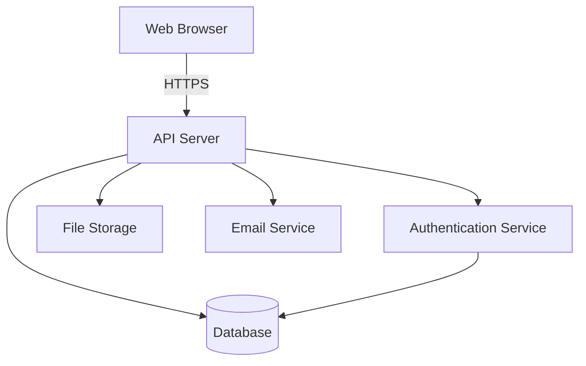
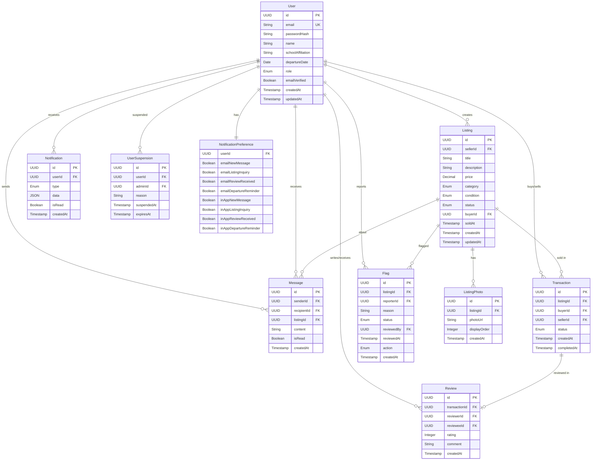

# Design Document: Teacher Marketplace

## Overview

The Teacher Marketplace is a web-based platform that enables teachers in international schools to buy and sell personal belongings before departing the country. The system provides a trusted, school-community-focused marketplace with user authentication, item listings, messaging, transaction tracking, and moderation capabilities.

The platform will be built as a modern web application with:
- A RESTful API backend for business logic and data management
- A responsive web frontend for user interactions
- A relational database for persistent storage
- Email service integration for notifications
- File storage service for photos

## Architecture

### System Components



### Technology Stack

**Backend:**
- RESTful API architecture
- JWT-based authentication
- Database: PostgreSQL (relational data with ACID guarantees)
- File storage: Cloud storage service (S3-compatible)
- Email: SMTP service or email API (SendGrid, Mailgun)

**Frontend:**
- Single Page Application (SPA)
- Responsive design for mobile and desktop
- Image upload and preview capabilities

### Architecture Principles

1. **Separation of Concerns**: Clear boundaries between authentication, business logic, data access, and presentation
2. **Stateless API**: All requests contain necessary authentication and context
3. **Security First**: Input validation, SQL injection prevention, XSS protection, CSRF tokens
4. **Scalability**: Horizontal scaling capability for API servers
5. **Data Integrity**: Database constraints and transactions for consistency

## Components and Interfaces

### 1. Authentication Service

**Responsibilities:**
- User registration with school email validation
- Login/logout with JWT token generation
- Email verification
- Password hashing and validation
- Session management

**Key Functions:**

```
register(email: String, password: String, name: String) -> Result<User, Error>
  - Validates email domain against allowed school domains
  - Hashes password using bcrypt
  - Creates user record with unverified status
  - Sends verification email
  - Returns user object or error

login(email: String, password: String) -> Result<AuthToken, Error>
  - Validates credentials
  - Checks email verification status
  - Generates JWT token with user ID and role
  - Returns token or error

verifyEmail(token: String) -> Result<Success, Error>
  - Validates verification token
  - Updates user status to verified
  - Returns success or error

hashPassword(password: String) -> String
  - Uses bcrypt with salt rounds = 12
  - Returns hashed password

validatePassword(password: String, hash: String) -> Boolean
  - Compares password against stored hash
  - Returns true if match, false otherwise
```

**Data Model:**
```
User {
  id: UUID
  email: String (unique, indexed)
  passwordHash: String
  name: String
  schoolAffiliation: String
  departureDate: Date (nullable)
  role: Enum (teacher, admin)
  emailVerified: Boolean
  createdAt: Timestamp
  updatedAt: Timestamp
}
```

### 2. Listing Service

**Responsibilities:**
- Create, read, update, delete listings
- Manage listing status (active, pending, sold, expired)
- Handle photo associations
- Filter and search listings
- Track listing views

**Key Functions:**

```
createListing(sellerId: UUID, data: ListingData) -> Result<Listing, Error>
  - Validates required fields (title, description, price, category)
  - Creates listing with active status
  - Associates with seller
  - Returns listing object or error

updateListing(listingId: UUID, sellerId: UUID, data: ListingData) -> Result<Listing, Error>
  - Validates ownership (sellerId matches listing owner)
  - Updates listing fields
  - Returns updated listing or error

deleteListing(listingId: UUID, sellerId: UUID) -> Result<Success, Error>
  - Validates ownership
  - Soft deletes listing (marks as deleted)
  - Returns success or error

markAsSold(listingId: UUID, sellerId: UUID, buyerId: UUID) -> Result<Success, Error>
  - Validates ownership
  - Updates status to sold
  - Records buyer and sale date
  - Returns success or error

searchListings(query: SearchQuery) -> List<Listing>
  - Filters by category, price range, condition, search text
  - Excludes non-active listings
  - Orders by creation date (newest first)
  - Returns matching listings

getListingById(listingId: UUID) -> Result<Listing, Error>
  - Retrieves listing with full details
  - Includes seller information
  - Returns listing or error
```

**Data Model:**
```
Listing {
  id: UUID
  sellerId: UUID (foreign key to User)
  title: String (max 100 chars)
  description: String (max 2000 chars)
  price: Decimal (positive)
  category: Enum (furniture, electronics, books, household, clothing, other)
  condition: Enum (new, like_new, good, fair)
  status: Enum (active, pending, sold, expired, deleted)
  buyerId: UUID (nullable, foreign key to User)
  soldAt: Timestamp (nullable)
  createdAt: Timestamp
  updatedAt: Timestamp
}

ListingPhoto {
  id: UUID
  listingId: UUID (foreign key to Listing)
  photoUrl: String
  displayOrder: Integer
  createdAt: Timestamp
}
```

### 3. Messaging Service

**Responsibilities:**
- Send and receive messages between buyers and sellers
- Maintain conversation threads per listing
- Track read/unread status
- Trigger notifications

**Key Functions:**

```
sendMessage(senderId: UUID, listingId: UUID, recipientId: UUID, content: String) -> Result<Message, Error>
  - Validates sender and recipient exist
  - Validates listing exists
  - Creates message in conversation thread
  - Triggers notification to recipient
  - Returns message object or error

getConversation(userId: UUID, listingId: UUID, otherUserId: UUID) -> List<Message>
  - Retrieves all messages in thread
  - Orders by timestamp (oldest first)
  - Marks messages as read for userId
  - Returns message list

getUserConversations(userId: UUID) -> List<ConversationSummary>
  - Retrieves all conversations for user
  - Includes last message and unread count
  - Orders by last message timestamp
  - Returns conversation summaries

markAsRead(messageId: UUID, userId: UUID) -> Result<Success, Error>
  - Validates user is recipient
  - Updates read status
  - Returns success or error
```

**Data Model:**
```
Message {
  id: UUID
  senderId: UUID (foreign key to User)
  recipientId: UUID (foreign key to User)
  listingId: UUID (foreign key to Listing)
  content: String (max 1000 chars)
  isRead: Boolean
  createdAt: Timestamp
}
```

### 4. Transaction Service

**Responsibilities:**
- Track transaction lifecycle
- Record transaction history
- Update listing status based on transaction state

**Key Functions:**

```
createTransaction(listingId: UUID, buyerId: UUID, sellerId: UUID) -> Result<Transaction, Error>
  - Validates listing is active
  - Creates transaction with pending status
  - Updates listing status to pending
  - Returns transaction object or error

completeTransaction(transactionId: UUID, userId: UUID) -> Result<Success, Error>
  - Validates user is seller
  - Updates transaction status to completed
  - Updates listing status to sold
  - Records completion timestamp
  - Returns success or error

cancelTransaction(transactionId: UUID, userId: UUID) -> Result<Success, Error>
  - Validates user is buyer or seller
  - Updates transaction status to cancelled
  - Restores listing status to active
  - Returns success or error

getTransactionHistory(userId: UUID) -> List<Transaction>
  - Retrieves all transactions where user is buyer or seller
  - Orders by creation date (newest first)
  - Returns transaction list
```

**Data Model:**
```
Transaction {
  id: UUID
  listingId: UUID (foreign key to Listing)
  buyerId: UUID (foreign key to User)
  sellerId: UUID (foreign key to User)
  status: Enum (pending, completed, cancelled)
  createdAt: Timestamp
  completedAt: Timestamp (nullable)
}
```

### 5. Review Service

**Responsibilities:**
- Create and manage reviews
- Calculate seller ratings
- Display reviews on profiles

**Key Functions:**

```
createReview(transactionId: UUID, reviewerId: UUID, revieweeId: UUID, rating: Integer, comment: String) -> Result<Review, Error>
  - Validates transaction is completed
  - Validates reviewer is buyer
  - Validates rating is 1-5
  - Creates review
  - Updates seller's average rating
  - Triggers notification to reviewee
  - Returns review object or error

getReviewsForUser(userId: UUID) -> List<Review>
  - Retrieves all reviews for user as seller
  - Orders by creation date (newest first)
  - Returns review list

calculateAverageRating(userId: UUID) -> Decimal
  - Retrieves all ratings for user
  - Calculates average
  - Returns average rating (0 if no reviews)
```

**Data Model:**
```
Review {
  id: UUID
  transactionId: UUID (foreign key to Transaction, unique)
  reviewerId: UUID (foreign key to User)
  revieweeId: UUID (foreign key to User)
  rating: Integer (1-5)
  comment: String (max 500 chars, nullable)
  createdAt: Timestamp
}
```

### 6. Photo Storage Service

**Responsibilities:**
- Upload and store listing photos
- Generate secure URLs for photo access
- Validate file types and sizes
- Delete photos when listings are removed

**Key Functions:**

```
uploadPhoto(listingId: UUID, file: File, displayOrder: Integer) -> Result<PhotoUrl, Error>
  - Validates file type (JPEG, PNG)
  - Validates file size (max 5MB)
  - Generates unique filename
  - Uploads to storage service
  - Creates ListingPhoto record
  - Returns photo URL or error

deletePhoto(photoId: UUID, listingId: UUID, sellerId: UUID) -> Result<Success, Error>
  - Validates ownership
  - Deletes from storage service
  - Deletes ListingPhoto record
  - Returns success or error

reorderPhotos(listingId: UUID, sellerId: UUID, photoOrder: List<UUID>) -> Result<Success, Error>
  - Validates ownership
  - Updates displayOrder for each photo
  - Returns success or error
```

### 7. Notification Service

**Responsibilities:**
- Send email notifications
- Create in-app notifications
- Manage notification preferences
- Send departure date reminders

**Key Functions:**

```
sendEmailNotification(userId: UUID, type: NotificationType, data: Map) -> Result<Success, Error>
  - Retrieves user email and preferences
  - Checks if email notifications enabled for type
  - Formats email template with data
  - Sends via email service
  - Returns success or error

createInAppNotification(userId: UUID, type: NotificationType, data: Map) -> Result<Notification, Error>
  - Creates notification record
  - Returns notification object or error

getUnreadNotifications(userId: UUID) -> List<Notification>
  - Retrieves unread notifications for user
  - Orders by creation date (newest first)
  - Returns notification list

markNotificationAsRead(notificationId: UUID, userId: UUID) -> Result<Success, Error>
  - Validates ownership
  - Updates read status
  - Returns success or error

sendDepartureDateReminders() -> Result<Success, Error>
  - Finds users with departure date within 7 days
  - Sends reminder notifications
  - Returns success or error (scheduled job)
```

**Data Model:**
```
Notification {
  id: UUID
  userId: UUID (foreign key to User)
  type: Enum (new_message, listing_inquiry, review_received, departure_reminder)
  data: JSON
  isRead: Boolean
  createdAt: Timestamp
}

NotificationPreference {
  userId: UUID (foreign key to User, unique)
  emailNewMessage: Boolean
  emailListingInquiry: Boolean
  emailReviewReceived: Boolean
  emailDepartureReminder: Boolean
  inAppNewMessage: Boolean
  inAppListingInquiry: Boolean
  inAppReviewReceived: Boolean
  inAppDepartureReminder: Boolean
}
```

### 8. Moderation Service

**Responsibilities:**
- Flag and review inappropriate content
- Suspend user accounts
- Admin dashboard functionality

**Key Functions:**

```
flagListing(listingId: UUID, reporterId: UUID, reason: String) -> Result<Success, Error>
  - Creates flag record
  - Notifies admins
  - Returns success or error

reviewFlaggedListing(listingId: UUID, adminId: UUID, action: ModerationAction) -> Result<Success, Error>
  - Validates admin role
  - Applies action (hide, delete, restore)
  - Updates listing status
  - Notifies listing owner
  - Returns success or error

suspendUser(userId: UUID, adminId: UUID, reason: String, duration: Integer) -> Result<Success, Error>
  - Validates admin role
  - Updates user status to suspended
  - Records suspension details
  - Notifies user
  - Returns success or error

getFlaggedListings(adminId: UUID) -> List<FlaggedListing>
  - Validates admin role
  - Retrieves all flagged listings pending review
  - Returns flagged listing list
```

**Data Model:**
```
Flag {
  id: UUID
  listingId: UUID (foreign key to Listing)
  reporterId: UUID (foreign key to User)
  reason: String
  status: Enum (pending, reviewed)
  reviewedBy: UUID (nullable, foreign key to User)
  reviewedAt: Timestamp (nullable)
  action: Enum (nullable: hide, delete, restore)
  createdAt: Timestamp
}

UserSuspension {
  id: UUID
  userId: UUID (foreign key to User)
  adminId: UUID (foreign key to User)
  reason: String
  suspendedAt: Timestamp
  expiresAt: Timestamp
}
```

## Data Models

### Entity Relationship Diagram



### Database Constraints

**User Table:**
- Primary key: id
- Unique constraint: email
- Check constraint: role IN ('teacher', 'admin')
- Index: email (for login lookups)

**Listing Table:**
- Primary key: id
- Foreign key: sellerId → User.id
- Foreign key: buyerId → User.id (nullable)
- Check constraint: price > 0
- Check constraint: status IN ('active', 'pending', 'sold', 'expired', 'deleted')
- Index: sellerId (for seller's listings)
- Index: status (for filtering active listings)
- Index: category (for category filtering)

**ListingPhoto Table:**
- Primary key: id
- Foreign key: listingId → Listing.id (ON DELETE CASCADE)
- Check constraint: displayOrder >= 0
- Index: listingId (for retrieving listing photos)

**Message Table:**
- Primary key: id
- Foreign key: senderId → User.id
- Foreign key: recipientId → User.id
- Foreign key: listingId → Listing.id
- Index: (recipientId, isRead) (for unread messages)
- Index: (listingId, senderId, recipientId) (for conversation threads)

**Transaction Table:**
- Primary key: id
- Foreign key: listingId → Listing.id (unique)
- Foreign key: buyerId → User.id
- Foreign key: sellerId → User.id
- Check constraint: status IN ('pending', 'completed', 'cancelled')
- Index: buyerId (for buyer's transactions)
- Index: sellerId (for seller's transactions)

**Review Table:**
- Primary key: id
- Foreign key: transactionId → Transaction.id (unique)
- Foreign key: reviewerId → User.id
- Foreign key: revieweeId → User.id
- Check constraint: rating BETWEEN 1 AND 5
- Index: revieweeId (for seller's reviews)

**Notification Table:**
- Primary key: id
- Foreign key: userId → User.id
- Index: (userId, isRead) (for unread notifications)

**Flag Table:**
- Primary key: id
- Foreign key: listingId → Listing.id
- Foreign key: reporterId → User.id
- Foreign key: reviewedBy → User.id (nullable)
- Check constraint: status IN ('pending', 'reviewed')
- Index: status (for pending flags)

**UserSuspension Table:**
- Primary key: id
- Foreign key: userId → User.id
- Foreign key: adminId → User.id
- Index: (userId, expiresAt) (for checking active suspensions)

## API Endpoints

### Authentication Endpoints

```
POST /api/auth/register
  Body: { email, password, name, schoolAffiliation }
  Response: { user, message: "Verification email sent" }

POST /api/auth/login
  Body: { email, password }
  Response: { token, user }

POST /api/auth/verify-email
  Body: { token }
  Response: { success: true }

POST /api/auth/logout
  Headers: Authorization: Bearer <token>
  Response: { success: true }
```

### Listing Endpoints

```
POST /api/listings
  Headers: Authorization: Bearer <token>
  Body: { title, description, price, category, condition }
  Response: { listing }

GET /api/listings
  Query: ?category=<cat>&minPrice=<min>&maxPrice=<max>&search=<query>
  Response: { listings: [...] }

GET /api/listings/:id
  Response: { listing, seller, photos }

PUT /api/listings/:id
  Headers: Authorization: Bearer <token>
  Body: { title, description, price, category, condition }
  Response: { listing }

DELETE /api/listings/:id
  Headers: Authorization: Bearer <token>
  Response: { success: true }

POST /api/listings/:id/mark-sold
  Headers: Authorization: Bearer <token>
  Body: { buyerId }
  Response: { success: true }

GET /api/users/:id/listings
  Response: { listings: [...] }
```

### Photo Endpoints

```
POST /api/listings/:id/photos
  Headers: Authorization: Bearer <token>
  Body: multipart/form-data { file, displayOrder }
  Response: { photo }

DELETE /api/listings/:listingId/photos/:photoId
  Headers: Authorization: Bearer <token>
  Response: { success: true }

PUT /api/listings/:id/photos/reorder
  Headers: Authorization: Bearer <token>
  Body: { photoOrder: [uuid1, uuid2, ...] }
  Response: { success: true }
```

### Messaging Endpoints

```
POST /api/messages
  Headers: Authorization: Bearer <token>
  Body: { listingId, recipientId, content }
  Response: { message }

GET /api/conversations
  Headers: Authorization: Bearer <token>
  Response: { conversations: [...] }

GET /api/conversations/:listingId/:otherUserId
  Headers: Authorization: Bearer <token>
  Response: { messages: [...] }

PUT /api/messages/:id/read
  Headers: Authorization: Bearer <token>
  Response: { success: true }
```

### Transaction Endpoints

```
POST /api/transactions
  Headers: Authorization: Bearer <token>
  Body: { listingId, sellerId }
  Response: { transaction }

PUT /api/transactions/:id/complete
  Headers: Authorization: Bearer <token>
  Response: { success: true }

PUT /api/transactions/:id/cancel
  Headers: Authorization: Bearer <token>
  Response: { success: true }

GET /api/transactions/history
  Headers: Authorization: Bearer <token>
  Response: { transactions: [...] }
```

### Review Endpoints

```
POST /api/reviews
  Headers: Authorization: Bearer <token>
  Body: { transactionId, revieweeId, rating, comment }
  Response: { review }

GET /api/users/:id/reviews
  Response: { reviews: [...], averageRating }
```

### User Profile Endpoints

```
GET /api/users/:id
  Response: { user, listings, reviews, averageRating }

PUT /api/users/profile
  Headers: Authorization: Bearer <token>
  Body: { name, schoolAffiliation, departureDate }
  Response: { user }

GET /api/users/profile/notifications
  Headers: Authorization: Bearer <token>
  Response: { notifications: [...] }

PUT /api/users/profile/notification-preferences
  Headers: Authorization: Bearer <token>
  Body: { emailNewMessage, inAppNewMessage, ... }
  Response: { preferences }
```

### Moderation Endpoints

```
POST /api/moderation/flag
  Headers: Authorization: Bearer <token>
  Body: { listingId, reason }
  Response: { success: true }

GET /api/moderation/flagged
  Headers: Authorization: Bearer <token> (admin only)
  Response: { flaggedListings: [...] }

POST /api/moderation/review
  Headers: Authorization: Bearer <token> (admin only)
  Body: { listingId, action }
  Response: { success: true }

POST /api/moderation/suspend-user
  Headers: Authorization: Bearer <token> (admin only)
  Body: { userId, reason, duration }
  Response: { success: true }
```


## Correctness Properties

A property is a characteristic or behavior that should hold true across all valid executions of a system—essentially, a formal statement about what the system should do. Properties serve as the bridge between human-readable specifications and machine-verifiable correctness guarantees.

### Authentication Properties

**Property 1: Valid registration creates account**
*For any* valid school email and password, registering should successfully create a new user account with unverified status.
**Validates: Requirements 1.1**

**Property 2: Invalid email domain rejection**
*For any* email with a domain not in the allowed school domains list, registration should be rejected with an appropriate error.
**Validates: Requirements 1.2**

**Property 3: Authentication round-trip**
*For any* successfully registered user, logging in with the same credentials should return a valid authentication token.
**Validates: Requirements 1.3**

**Property 4: Invalid credentials rejection**
*For any* incorrect password or non-existent email, login attempts should be rejected with an error.
**Validates: Requirements 1.4**

**Property 5: Email verification requirement**
*For any* unverified user account, attempts to create listings or send messages should be rejected until email is verified.
**Validates: Requirements 1.5**

### Listing Management Properties

**Property 6: Valid listing creation**
*For any* valid listing data (title, description, price, category, condition), creating a listing should succeed and return a listing with active status.
**Validates: Requirements 2.1, 2.6**

**Property 7: Photo storage and retrieval**
*For any* valid image file uploaded to a listing, the photo should be stored and retrievable with the listing details.
**Validates: Requirements 2.2**

**Property 8: Required field validation**
*For any* listing data missing required fields (title, description, price, or category), creation should be rejected with an error indicating the missing fields.
**Validates: Requirements 2.3**

**Property 9: Enum value acceptance**
*For any* valid enum value (condition: new/like_new/good/fair, category: furniture/electronics/books/household/clothing/other), creating a listing with that value should succeed.
**Validates: Requirements 2.4, 2.5**

**Property 10: Active listing visibility**
*For any* set of listings with various statuses, browsing the marketplace should return only listings with active status.
**Validates: Requirements 3.1**

**Property 11: Search matching**
*For any* search query, all returned listings should contain the query text in either the title or description (case-insensitive).
**Validates: Requirements 3.2**

**Property 12: Category filtering**
*For any* category filter, all returned listings should have that exact category value.
**Validates: Requirements 3.3**

**Property 13: Price range filtering**
*For any* price range (min, max), all returned listings should have prices within that range (inclusive).
**Validates: Requirements 3.4**

**Property 14: Listing detail completeness**
*For any* listing, retrieving its details should include all required fields (title, description, price, category, condition, photos, seller information).
**Validates: Requirements 3.5**

**Property 15: Seller listing retrieval**
*For any* seller with multiple listings, retrieving their profile should return all listings they created.
**Validates: Requirements 4.1, 7.3**

**Property 16: Listing update round-trip**
*For any* listing and valid update data, updating the listing then retrieving it should reflect all the changes.
**Validates: Requirements 4.2**

**Property 17: Sold status transition**
*For any* active listing marked as sold, it should no longer appear in active listing searches and should have status 'sold'.
**Validates: Requirements 4.3**

**Property 18: Listing deletion**
*For any* listing that is deleted, subsequent attempts to retrieve it should return an error or not found response.
**Validates: Requirements 4.4**

**Property 19: Pending status transition**
*For any* active listing marked as pending, its status should change to pending and it should still be retrievable but marked as such.
**Validates: Requirements 4.5**

### Messaging Properties

**Property 20: Message delivery**
*For any* message sent from a buyer to a seller (or vice versa) about a listing, the recipient should be able to retrieve that message in their conversation thread.
**Validates: Requirements 5.1, 5.3**

**Property 21: Message notification creation**
*For any* message sent, a notification should be created for the recipient (both email and in-app, subject to user preferences).
**Validates: Requirements 5.2, 12.1, 12.2, 12.3**

**Property 22: Conversation thread grouping**
*For any* set of messages between two users about the same listing, all messages should be retrievable as a single ordered conversation thread.
**Validates: Requirements 5.4**

**Property 23: Unread message count accuracy**
*For any* user with messages, the unread count should equal the number of messages where isRead is false and the user is the recipient.
**Validates: Requirements 5.5**

### Transaction Properties

**Property 24: Transaction creation**
*For any* active listing and buyer, creating a transaction should set the transaction status to pending and update the listing status to pending.
**Validates: Requirements 6.1**

**Property 25: Transaction completion**
*For any* pending transaction, completing it should update the transaction status to completed, set the listing status to sold, and record the completion timestamp and buyer information.
**Validates: Requirements 6.2, 6.3**

**Property 26: Transaction history persistence**
*For any* completed or cancelled transaction, it should appear in the transaction history for both the buyer and seller.
**Validates: Requirements 6.4**

**Property 27: Transaction cancellation round-trip**
*For any* pending transaction, cancelling it should restore the listing to active status and mark the transaction as cancelled.
**Validates: Requirements 6.5**

### User Profile Properties

**Property 28: Profile data completeness**
*For any* user profile, it should display name, school affiliation, join date, active listings, rating, and review count.
**Validates: Requirements 7.1, 7.4, 7.5**

**Property 29: Profile update round-trip**
*For any* user profile and valid update data (name, school affiliation, departure date), updating then retrieving the profile should reflect all changes.
**Validates: Requirements 7.2**

### Review Properties

**Property 30: Review creation after transaction**
*For any* completed transaction, the buyer should be able to create a review with a rating (1-5) and optional comment for the seller.
**Validates: Requirements 8.1, 8.2**

**Property 31: Review visibility**
*For any* review created, it should appear on the seller's profile and be retrievable.
**Validates: Requirements 8.3**

**Property 32: Average rating calculation**
*For any* seller with multiple reviews, their average rating should equal the sum of all ratings divided by the number of reviews.
**Validates: Requirements 8.4**

**Property 33: Review notification**
*For any* review created, a notification should be sent to the seller (reviewee).
**Validates: Requirements 8.5**

### Moderation Properties

**Property 34: Listing hiding on flag**
*For any* listing flagged by an admin as inappropriate, it should be hidden from public listing searches.
**Validates: Requirements 9.1**

**Property 35: Admin moderation actions**
*For any* flagged listing, an admin should be able to delete it permanently or restore it to active status.
**Validates: Requirements 9.2**

**Property 36: User suspension**
*For any* user suspended by an admin, they should be unable to create listings, send messages, or perform other actions until the suspension expires.
**Validates: Requirements 9.3**

**Property 37: Admin visibility**
*For any* admin user, they should be able to retrieve all listings regardless of status and view all user activity.
**Validates: Requirements 9.4**

**Property 38: Flag notification**
*For any* listing reported by a user, a notification should be created for all admin users.
**Validates: Requirements 9.5**

### Departure Date Properties

**Property 39: Departure date storage**
*For any* valid departure date set on a user profile, it should be stored and retrievable.
**Validates: Requirements 10.1**

**Property 40: Departure date display on listings**
*For any* seller with a departure date set, all their active listings should display that departure date.
**Validates: Requirements 10.2**

**Property 41: Urgency indicator display**
*For any* listing where the seller's departure date is within 30 days from the current date, an urgency indicator should be displayed.
**Validates: Requirements 10.3**

**Property 42: Leaving soon filter**
*For any* filter for "leaving soon" (departure within 30 days), all returned listings should be from sellers with departure dates within 30 days.
**Validates: Requirements 10.4**

**Property 43: Automatic expiration**
*For any* listing where the seller's departure date has passed, the listing status should be automatically updated to expired.
**Validates: Requirements 10.5**

### Photo Management Properties

**Property 44: Photo upload limit**
*For any* listing, attempting to upload more than 8 photos should be rejected with an error.
**Validates: Requirements 11.1**

**Property 45: Photo validation**
*For any* uploaded file, it should be accepted only if it's a JPEG or PNG file under 5MB; otherwise it should be rejected with an appropriate error.
**Validates: Requirements 11.2, 11.3**

**Property 46: Photo reordering**
*For any* listing with multiple photos, reordering them should preserve the new order, with the first photo being the primary image.
**Validates: Requirements 11.4**

**Property 47: Photo deletion**
*For any* photo associated with a listing, deleting it should remove it from the listing's photo collection.
**Validates: Requirements 11.5**

### Notification Properties

**Property 48: Notification preference respect**
*For any* user with specific notification preferences, notifications should only be sent via the channels they've enabled (email, in-app, or both).
**Validates: Requirements 12.4**

**Property 49: Departure reminder notification**
*For any* seller with a departure date within 7 days, a reminder notification should be sent.
**Validates: Requirements 12.5**

## Error Handling

### Input Validation Errors

**Invalid Email Format:**
- Return 400 Bad Request with message: "Invalid email format"
- Log validation failure

**Invalid School Domain:**
- Return 403 Forbidden with message: "Email must be from an approved school domain"
- Log attempted registration with invalid domain

**Missing Required Fields:**
- Return 400 Bad Request with message: "Missing required fields: [field names]"
- Include list of missing fields in response

**Invalid Price:**
- Return 400 Bad Request with message: "Price must be a positive number"
- Log validation failure

**Invalid File Type:**
- Return 400 Bad Request with message: "File must be JPEG or PNG"
- Log upload attempt with invalid type

**File Too Large:**
- Return 413 Payload Too Large with message: "File size must be under 5MB"
- Log upload attempt with size

**Too Many Photos:**
- Return 400 Bad Request with message: "Maximum 8 photos allowed per listing"
- Log attempt to exceed limit

### Authentication Errors

**Invalid Credentials:**
- Return 401 Unauthorized with message: "Invalid email or password"
- Log failed login attempt (without password)
- Implement rate limiting to prevent brute force

**Email Not Verified:**
- Return 403 Forbidden with message: "Please verify your email before accessing this feature"
- Include link to resend verification email

**Expired Token:**
- Return 401 Unauthorized with message: "Session expired, please login again"
- Clear client-side token

**Missing Token:**
- Return 401 Unauthorized with message: "Authentication required"
- Redirect to login page

**Suspended Account:**
- Return 403 Forbidden with message: "Account suspended until [date]: [reason]"
- Include suspension details

### Authorization Errors

**Insufficient Permissions:**
- Return 403 Forbidden with message: "You don't have permission to perform this action"
- Log unauthorized access attempt

**Not Listing Owner:**
- Return 403 Forbidden with message: "You can only modify your own listings"
- Log attempt to modify other user's listing

**Not Admin:**
- Return 403 Forbidden with message: "Admin privileges required"
- Log unauthorized admin action attempt

### Resource Errors

**Listing Not Found:**
- Return 404 Not Found with message: "Listing not found"
- Log request for non-existent listing

**User Not Found:**
- Return 404 Not Found with message: "User not found"
- Log request for non-existent user

**Transaction Not Found:**
- Return 404 Not Found with message: "Transaction not found"
- Log request for non-existent transaction

**Listing Already Sold:**
- Return 409 Conflict with message: "This listing has already been sold"
- Include sold date and buyer info (if authorized)

**Listing Not Active:**
- Return 409 Conflict with message: "This listing is not available for purchase"
- Include current status

### Database Errors

**Connection Failure:**
- Return 503 Service Unavailable with message: "Service temporarily unavailable"
- Log database connection error
- Retry with exponential backoff
- Alert operations team

**Constraint Violation:**
- Return 409 Conflict with message: "Operation violates data constraints"
- Log constraint violation details
- Return user-friendly message based on constraint

**Transaction Deadlock:**
- Retry transaction up to 3 times
- If still failing, return 503 Service Unavailable
- Log deadlock occurrence

### External Service Errors

**Email Service Failure:**
- Log error with details
- Queue email for retry
- Return success to user (email is async)
- Alert if queue grows too large

**File Storage Failure:**
- Return 503 Service Unavailable with message: "Unable to upload photo, please try again"
- Log storage service error
- Alert operations team

### Error Response Format

All error responses follow this JSON structure:

```json
{
  "error": {
    "code": "ERROR_CODE",
    "message": "Human-readable error message",
    "details": {
      "field": "Additional context if applicable"
    },
    "timestamp": "2024-01-15T10:30:00Z",
    "requestId": "uuid-for-tracking"
  }
}
```

### Error Logging

All errors should be logged with:
- Timestamp
- Request ID (for tracing)
- User ID (if authenticated)
- Error type and message
- Stack trace (for 500 errors)
- Request details (method, path, relevant parameters)

Sensitive information (passwords, tokens) must never be logged.

## Testing Strategy

### Dual Testing Approach

The testing strategy employs both unit tests and property-based tests as complementary approaches:

**Unit Tests:**
- Verify specific examples and edge cases
- Test integration points between components
- Validate error conditions and error messages
- Test specific user scenarios (e.g., "user registers with valid email")
- Fast execution for quick feedback

**Property-Based Tests:**
- Verify universal properties across all inputs
- Generate random valid and invalid inputs
- Catch edge cases that might be missed in unit tests
- Validate correctness properties from the design document
- Each test runs minimum 100 iterations

Together, these approaches provide comprehensive coverage: unit tests catch concrete bugs in specific scenarios, while property tests verify general correctness across the input space.

### Property-Based Testing Configuration

**Framework Selection:**
- Python: Use Hypothesis library
- TypeScript/JavaScript: Use fast-check library
- Java: Use jqwik library

**Test Configuration:**
- Minimum 100 iterations per property test
- Each property test must reference its design document property
- Tag format: `Feature: teacher-marketplace, Property {number}: {property_text}`

**Example Property Test Structure:**

```python
# Feature: teacher-marketplace, Property 1: Valid registration creates account
@given(valid_school_email(), valid_password())
def test_valid_registration_creates_account(email, password):
    result = auth_service.register(email, password, "Test User")
    assert result.is_success()
    assert result.user.email == email
    assert result.user.email_verified == False
```

### Test Coverage Requirements

**Authentication Service:**
- Unit tests: Valid registration, invalid email domain, login success, login failure, email verification
- Property tests: Properties 1-5 (registration, authentication, verification)

**Listing Service:**
- Unit tests: Create listing with all fields, missing required fields, update listing, delete listing
- Property tests: Properties 6-19 (listing creation, validation, search, filtering, management)

**Messaging Service:**
- Unit tests: Send message, retrieve conversation, mark as read
- Property tests: Properties 20-23 (message delivery, notifications, threading, unread counts)

**Transaction Service:**
- Unit tests: Create transaction, complete transaction, cancel transaction
- Property tests: Properties 24-27 (transaction lifecycle, history)

**Review Service:**
- Unit tests: Create review, calculate average rating
- Property tests: Properties 30-33 (review creation, visibility, rating calculation)

**Photo Storage Service:**
- Unit tests: Upload valid photo, reject invalid file type, reject oversized file
- Property tests: Properties 44-47 (upload limits, validation, ordering, deletion)

**Notification Service:**
- Unit tests: Send email notification, create in-app notification, respect preferences
- Property tests: Properties 48-49 (preference respect, scheduled reminders)

**Moderation Service:**
- Unit tests: Flag listing, admin review, suspend user
- Property tests: Properties 34-38 (hiding, moderation actions, suspension, visibility)

**User Profile Service:**
- Unit tests: Get profile, update profile, set departure date
- Property tests: Properties 28-29, 39-43 (profile data, updates, departure tracking)

### Integration Testing

**API Endpoint Tests:**
- Test each endpoint with valid and invalid inputs
- Verify HTTP status codes and response formats
- Test authentication and authorization
- Verify error responses match specification

**Database Integration:**
- Test all CRUD operations
- Verify constraints are enforced
- Test transaction rollback on errors
- Verify indexes improve query performance

**External Service Integration:**
- Mock email service for testing
- Mock file storage for testing
- Verify retry logic for failures
- Test graceful degradation

### End-to-End Testing Scenarios

1. **Complete Listing Flow:**
   - Register user → Verify email → Create listing → Upload photos → View listing

2. **Complete Purchase Flow:**
   - Buyer searches → Views listing → Messages seller → Creates transaction → Completes transaction → Leaves review

3. **Moderation Flow:**
   - User reports listing → Admin reviews → Admin takes action → User receives notification

4. **Departure Flow:**
   - Seller sets departure date → Listings show urgency → Date passes → Listings expire

### Performance Testing

**Load Testing:**
- Simulate 1000 concurrent users browsing listings
- Measure response times under load
- Identify bottlenecks

**Database Performance:**
- Verify indexes are used for common queries
- Test query performance with large datasets (10,000+ listings)
- Monitor slow query log

**File Upload Performance:**
- Test concurrent photo uploads
- Verify upload progress tracking
- Test large file handling (up to 5MB)

### Security Testing

**Authentication Security:**
- Test password hashing (bcrypt with proper salt rounds)
- Test JWT token expiration
- Test rate limiting on login attempts
- Test session management

**Input Validation:**
- Test SQL injection prevention
- Test XSS prevention in user-generated content
- Test CSRF protection
- Test file upload validation

**Authorization:**
- Test that users can only modify their own resources
- Test admin-only endpoints reject non-admin users
- Test suspended users cannot perform actions

### Continuous Integration

**Automated Test Execution:**
- Run all unit tests on every commit
- Run property tests on every pull request
- Run integration tests before deployment
- Run security tests weekly

**Test Coverage Goals:**
- Minimum 80% code coverage for unit tests
- All correctness properties implemented as property tests
- All API endpoints covered by integration tests
- All error conditions tested
